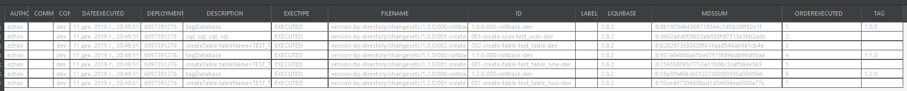

# learn-liquibase

## Подготовка базы данных

1. Стянуть Docker образ
    ```
    docker pull oracleinanutshell/oracle-xe-11g
    ```
1. Запустить образ
    ```
    docker run -d -p 49161:1521 --name oracle-test-db oracleinanutshell/oracle-xe-11g
    ```
1. Использовать подключение
    ```properties
    hostname=localhost
    port=49161
    sid=xe
    username=system
    password=oracle
    ```
1. Установить Oracle Jdbc
    ```
    mvn install:install-file -Dfile=D:/ojdbc8-12.2.0.1.jar -DgroupId=com.oracle -DartifactId=ojdbc8 -Dversion=12.2.0.1 -Dpackaging=jar
    ``` 

## Сборка/накат/откат для тегов в каждом файле

1. Собрать и накатить БД
    ``` 
    mvn clean package liquibase:update -Dliquibase.contexts=dev -Dliquibase.changeLogFile=version-in-every-file/changelog.xml -Dliquibase.username=system -Dliquibase.password=oracle -Dliquibase.url=jdbc:oracle:thin:@//localhost:49161/xe
    ```

1. Собрать и откатить версию 1.0.0
    ```
    mvn clean package liquibase:rollback -Dliquibase.rollbackTag=1.0.0  -Dliquibase.contexts=dev -Dliquibase.changeLogFile=version-in-every-file/changelog.xml -Dliquibase.username=system -Dliquibase.password=oracle -Dliquibase.url=jdbc:oracle:thin:@//localhost:49161/xe
    ```
1. Собрать и откатить версию 1.1.0
    ```
    mvn clean package liquibase:rollback -Dliquibase.rollbackTag=1.1.0  -Dliquibase.contexts=dev -Dliquibase.changeLogFile=version-in-every-file/changelog.xml -Dliquibase.username=system -Dliquibase.password=oracle -Dliquibase.url=jdbc:oracle:thin:@//localhost:49161/xe
    ```
1. Собрать и откатить версию 1.2.0
    ```
    mvn clean package liquibase:rollback -Dliquibase.rollbackTag=1.2.0  -Dliquibase.contexts=dev -Dliquibase.changeLogFile=version-in-every-file/changelog.xml -Dliquibase.username=system -Dliquibase.password=oracle -Dliquibase.url=jdbc:oracle:thin:@//localhost:49161/xe
    ```
   
Содержимое **DATABASECHANGELOG** после наката


Содержимое **DATABASECHANGELOG** после отката к версии 1.0.0
   
   
## Сборка/накат/откат для тегов в одном файле в папке с версией

1. Собрать и накатить БД
    ``` 
    mvn clean package liquibase:update -Dliquibase.contexts=dev -Dliquibase.changeLogFile=version-by-directory/changelog.xml -Dliquibase.username=system -Dliquibase.password=oracle -Dliquibase.url=jdbc:oracle:thin:@//localhost:49161/xe
    ```

1. Собрать и откатить версию 1.0.0
    ```
    mvn clean package liquibase:rollback -Dliquibase.rollbackTag=1.0.0  -Dliquibase.contexts=dev -Dliquibase.changeLogFile=version-by-directory/changelog.xml -Dliquibase.username=system -Dliquibase.password=oracle -Dliquibase.url=jdbc:oracle:thin:@//localhost:49161/xe
    ```
1. Собрать и откатить версию 1.1.0
    ```
    mvn clean package liquibase:rollback -Dliquibase.rollbackTag=1.1.0  -Dliquibase.contexts=dev -Dliquibase.changeLogFile=version-by-directory/changelog.xml -Dliquibase.username=system -Dliquibase.password=oracle -Dliquibase.url=jdbc:oracle:thin:@//localhost:49161/xe
    ```
1. Собрать и откатить версию 1.2.0
    ```
    mvn clean package liquibase:rollback -Dliquibase.rollbackTag=1.2.0  -Dliquibase.contexts=dev -Dliquibase.changeLogFile=version-by-directory/changelog.xml -Dliquibase.username=system -Dliquibase.password=oracle -Dliquibase.url=jdbc:oracle:thin:@//localhost:49161/xe
    ```   
   
Содержимое **DATABASECHANGELOG** после наката


Содержимое **DATABASECHANGELOG** после отката к версии 1.0.0
      
   
## Остановка контейнера   
```
docker container ls 
docker container stop oracle-test-db
```   

## Резюме

**Liquibase** для отката использует механизм тегов.

Тег указывается следующим образом
```xml
<changeSet context="dev" author="ezhov" id="rollback-003-create-table-test_table_two-dev">
    <tagDatabase tag="1.2.0"/>
</changeSet>
```

Откат происходит до этого тега.

Этот проект воспроизводит следующий пример отката:
1. Разрабатывается приложение с версией 1.0.0
1. Затем приложение с версией 1.1.0
1. Затем приложение с версией 1.2.0
 
При указании конкретной версии для отката происходит откат указанной версии, то есть не **ДО** версии такой-то, а **ВКЛЮЧИТЕЛЬНО** версию такую-то.  
Это позволяет избежать путаницы в случае отката после поставки.  

Пример сценария: 
- Поставилась версия 1.1.0
- Необходимо откатить только что поставленную версию из-за ошибок
- Указывается для отката версия 1.1.0 

Для возможности использования такого сценария отката тэг для отката необходимо указывать **ПЕРЕД** выполняемыми changeSet-ами. 